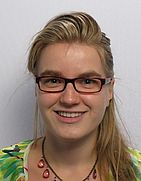

The student chapter is open for everyone at TU Delft with an interest in applied mathematics.

The board 2014-2015
===================

President: [Manuel Baumann]
---------------------------

Hi! My name is Manuel and I am a PhD student of Martin van Gijzen. My research is in the field of numerical linear algebra, but I am also interested in model order reduction and optimal control.
Besides math, I like tennis and skying as well as traveling. My last vacation was in China (see right). You can best contact me via [email](mailto:M.M.Baumann@tudelft.nl) or twitter [@ManuelMBaumann](https://twitter.com/ManuelMBaumann).

Vice President: [Reinaldo Astudillo]
---------------------------

Hello all! I'm Reinaldo and my Co-promotor and daily supervisor is dr.ir. Martin van Gijzen. My promotor is Prof dr.ir. Kess Vuik and my interest is Numerical linear algebra in general, focus on Krylov subspace methods, spectra and pseduspectra computations, linear systems, preconditioning. The best way to contact me is via [email](mailto:R.A.Astudillo@tudelft.nl) or twitter [@astudillor](https://twitter.com/astudillor).

Secretary and Treasurer: Thea Vuik 
---------------------------

My name is Thea Vuik and I am the first secretary and treasure of the first SIAM Student Chapter in The Netherlands, at Delft University of Technology. In addition to this honourable task, I am a PhD student, working with Dr. Jennifer Ryan. My research focuses on the detection of shocks and discontinuities in discontinuous Galerkin schemes, using a multiwavelet decomposition. If you have any questions about my research or the SIAM Student Chapter, don't hesitate to ask me! You can reach me by sending an [email](mailto:M.J.Vuik@tudelft.nl).

<b>Webmaster:</b> Joost van Zwieten

[Manuel Baumann]: http://www.manuelbaumann.de
[Reinaldo Astudillo]: http://ta.twi.tudelft.nl/nw/users/rastudillo/
