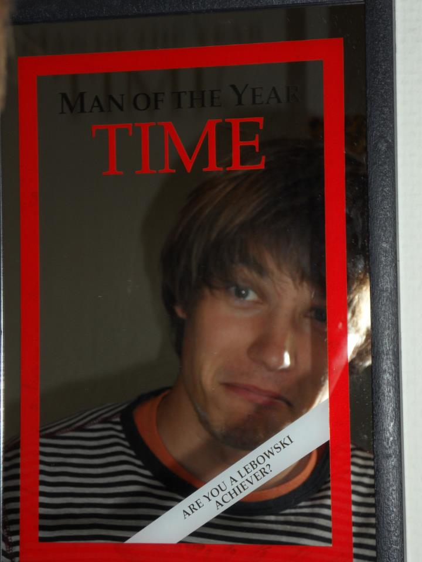

The student chapter is open for everyone at TU Delft with an interest in applied mathematics.

The board 2014-2015
===================

### President: [Manuel Baumann]
<!--   -->
email to [M.M.Baumann@tudelft.nl](mailto:M.M.Baumann@tudelft.nl).

### Vice President: [Reinaldo Astudillo]
email to [R.A.Astudillo@tudelft.nl](mailto:R.A.Astudillo@tudelft.nl).

### Secretary and Treasurer: Thea Vuik 
My name is Thea Vuik and I am the first secretary and treasure of the first SIAM Student Chapter in The Netherlands, at Delft University of Technology. In addition to this honourable task, I am a PhD student, working with Dr. Jennifer Ryan. My research focuses on the detection of shocks and discontinuities in discontinuous Galerkin schemes, using a multiwavelet decomposition. If you have any questions about my research or the SIAM Student Chapter, don't hesitate to ask me! You can reach me by sending an email to [M.J.Vuik@tudelft.nl](mailto:M.J.Vuik@tudelft.nl).

Webmaster: Joost van Zwieten

[Manuel Baumann]: http://www.manuelbaumann.de
[Reinaldo Astudillo]: http://ta.twi.tudelft.nl/nw/users/rastudillo/
